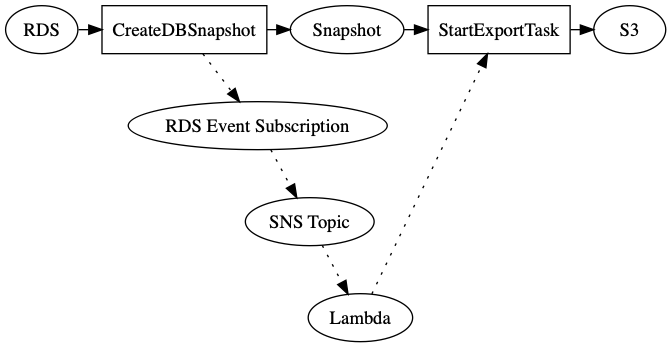

# Automated RDS Snapshot Export

This project demonstrates how CDK can be used to configure RDS snapshots to automatically export to S3 as parquet files, using AWS RDS's [Snapshot Export to S3](https://aws.amazon.com/about-aws/whats-new/2020/01/announcing-amazon-relational-database-service-snapshot-export-to-s3/) feature.

